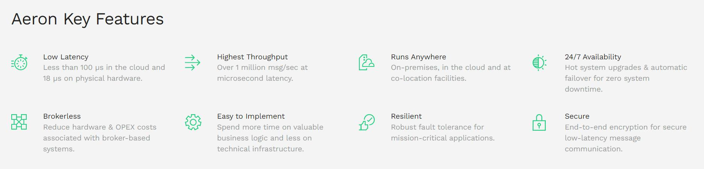

# 说明
交易所、券商新一代系统建设，中基础架构、基础组件至关重要，而通信组件基本上必不可少，经常会提到“分布式容错消息总线”。
本部分内容对于“分布式容错消息总线”的内容进行整理。

# Aeron开源库

Aeron是作为开源项目，提供高效可靠的UDP单播、UDP组播和IPC消息传输-其核心设计目标是达到任何消息传递系统最高的吞吐量，同时具有最低和最可预测的延迟。Aeron Archive允许将消息流记录到持久存储中，以供以后或实时重播。Aeron Cluster提供跨多个流的容错总顺序。

是由global公司进行维护，xx人员大家有了解吧，disruptor。

## 主要特性



- 低延迟

  ​	云部署：100微妙 裸金属部署：18微妙

- 高吞吐

  每秒100万消息，延迟在微妙级别

- 7*24消息

- 无中心

  不用额外部署和运维

- 便于使用

  专注于业务逻辑实现

- 健壮性

- 安全型

## 概述

高吞吐量、低延迟、故障容错的交易系统的全球技术标准。

Aeron在进程或网络边界之间有效地复制有序日志缓冲区，并具有可预测的延迟。Aeron API提供了三个主要的交互点：媒体驱动程序、发布和订阅。

媒体驱动程序支持UDP和IPC。

## 基础架构

## 基本使用

在官网帮助文档中，介绍了通过Aeron完成IPC通信的例子。

[aeron-ipc项目中](https://github.com/real-logic/aeron-cookbook-code/blob/main/ipc-core/src/main/java/com/aeroncookbook/ipc/SimplestCase.java)的示例：

### 样例组成

通过4部分组成：Aeron API、媒体驱动器、发布者、订阅者。

样例代码如下：

```java
public static void main(String[] args)
{
    final String channel = "aeron:ipc";
    final String message = "my message";
    final IdleStrategy idle = new SleepingIdleStrategy();
    final UnsafeBuffer unsafeBuffer = new UnsafeBuffer(ByteBuffer.allocate(256));
    try (MediaDriver driver = MediaDriver.launch();
        Aeron aeron = Aeron.connect();
        Subscription sub = aeron.addSubscription(channel, 10);
        Publication pub = aeron.addPublication(channel, 10))
    {
        while (!pub.isConnected())
        {
            idle.idle();
        }
        unsafeBuffer.putStringAscii(0, message);
        System.out.println("sending:" + message);
        while (pub.offer(unsafeBuffer) < 0)
        {
            idle.idle();
        }
        FragmentHandler handler = (buffer, offset, length, header) ->
            System.out.println("received:" + buffer.getStringAscii(offset));
        while (sub.poll(handler, 1) <= 0)
        {
            idle.idle();
        }
    }
}
```

(1) 对象初始化

-  设定了pub/sub通信的通道；
- 等待策略；
- 发送缓冲buffer。

(2)创建Aeron对象

- 创建媒体驱动器
- 创建Aeron对象，作为后续主要的API用于应用程序和Aeron通信
- 订阅用于接收消息
- 发布用于发送消息

（3）发送消息

- 判断订阅是否连接
- 订阅时buffer是否装满

（4）接收消息

- 通过FragmentHandler获取消息
- 订阅端poll获取消息。

## 媒体驱动器


## 频道、数据流和会话

当创建发布&订阅对的时候，需要定义频道和数据流ID。


## 发布

主要通过两个方法向订阅者发布数据：offer和tryClaim，两者都是阻塞的。

需要发送的数据增加到本地Log Buffer。通过媒体驱动进行异步发送。

应用消息和Aeron消息

Aeron还可以将较小的应用程序消息数据整合到更少的网络消息中。


## 反压


## 编译
笔者在CentOS Stream 8上面做了编译，gcc版本、cmake版本等符合编译的条件。编译完成之后在/cppbuild/Release/lib/目录下面生成了库：

[aeron编译后的库](aeron库.jpg)


测试：
在目录`/root/software/aeron/cppbuild/Release/binaries`中有测试程序。可以执行`Ping`，但是会报错：

FAILED: no driver heartbeat detected : static aeron::util::MemoryMappedFile::ptr_t aeron::Aeron::mapCncFile(aeron::Context&) : aeron-client/src/main/cpp/Aeron.cpp
是因为Media Driver没有启动。
执行`./aeronmd`，然后执行`Ping`:

